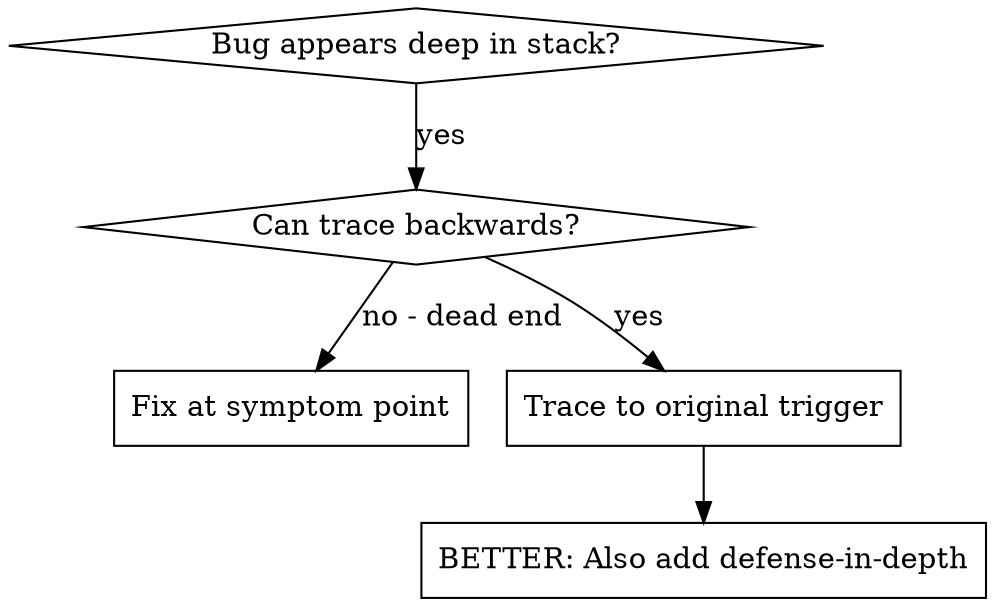
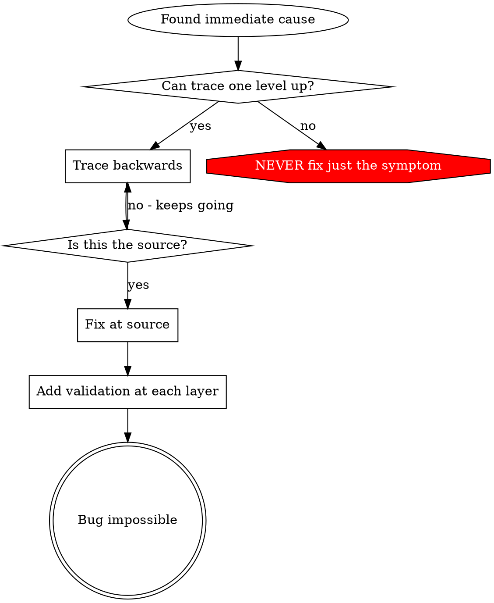

# Root Cause Tracing

## Overview

Bugs often manifest deep in the call stack (git init in wrong directory, file created in wrong location, database opened with wrong path). Your instinct is to fix where the error appears, but that's treating a symptom.

**Core principle:** Trace backward through the call chain until you find the original trigger, then fix at the source.

## When to Use



**Use when:**
- Error happens deep in execution (not at entry point)
- Stack trace shows long call chain
- Unclear where invalid data originated
- Need to find which test/code triggers the problem

## The Tracing Process

### 1. Observe the Symptom
```
Error: git init failed in /Users/jesse/project/packages/core
```

### 2. Find Immediate Cause
**What code directly causes this?**
```typescript
await execFileAsync('git', ['init'], { cwd: projectDir });
```

### 3. Ask: What Called This?
```typescript
WorktreeManager.createSessionWorktree(projectDir, sessionId)
  → called by Session.initializeWorkspace()
  → called by Session.create()
  → called by test at Project.create()
```

### 4. Keep Tracing Up
**What value was passed?**
- `projectDir = ''` (empty string!)
- Empty string as `cwd` resolves to `process.cwd()`
- That's the source code directory!

### 5. Find Original Trigger
**Where did empty string come from?**
```typescript
const context = setupCoreTest(); // Returns { tempDir: '' }
Project.create('name', context.tempDir); // Accessed before beforeEach!
```

## Adding Stack Traces

When you can't trace manually, add instrumentation:

```typescript
// Before the problematic operation
async function gitInit(directory: string) {
  const stack = new Error().stack;
  console.error('DEBUG git init:', {
    directory,
    cwd: process.cwd(),
    nodeEnv: process.env.NODE_ENV,
    stack,
  });

  await execFileAsync('git', ['init'], { cwd: directory });
}
```

**Critical:** Use `console.error()` in tests (not logger - may not show)

**Run and capture:**
```bash
npm test 2>&1 | grep 'DEBUG git init'
```

**Analyze stack traces:**
- Look for test file names
- Find the line number triggering the call
- Identify the pattern (same test? same parameter?)

## Finding Which Test Causes Pollution

If something appears during tests but you don't know which test:

Use the bisection script `find-polluter.sh` in this directory:

```bash
./find-polluter.sh '.git' 'src/**/*.test.ts'
```

Runs tests one-by-one, stops at first polluter. See script for usage.

## Real Example: Empty projectDir

**Symptom:** `.git` created in `packages/core/` (source code)

**Trace chain:**
1. `git init` runs in `process.cwd()` ← empty cwd parameter
2. WorktreeManager called with empty projectDir
3. Session.create() passed empty string
4. Test accessed `context.tempDir` before beforeEach
5. setupCoreTest() returns `{ tempDir: '' }` initially

**Root cause:** Top-level variable initialization accessing empty value

**Fix:** Made tempDir a getter that throws if accessed before beforeEach

**Also added defense-in-depth:**
- Layer 1: Project.create() validates directory
- Layer 2: WorkspaceManager validates not empty
- Layer 3: NODE_ENV guard refuses git init outside tmpdir
- Layer 4: Stack trace logging before git init

### Multi-Agent Consensus Validation (Recommended)

Before implementing fix, validate the traced causal path with multiple agents.

**When to use:**
- Long causal chains with multiple components
- Unclear if traced to true root vs intermediate cause
- Multiple possible root triggers
- High-risk fixes

**When to skip:**
- Short, obvious causal chain (1-2 steps)
- Single clear trigger point
- Time-critical emergencies

**How it works:**

1. **Agent extracts traced path:**
   ```
   ## Error Description
   <Symptom observed deep in call stack>

   ## Evidence Collected
   <Traced path, stack traces, reproduction steps>

   ## Root Cause Hypothesis
   <Original trigger identified>

   ## Proposed Fix
   <Fix at trigger point>
   ```

2. **Invoke consensus:**
   ```bash
   conclave consensus --mode=general-prompt \
     --prompt="Review this causal trace from symptom to root trigger. Is the traced path complete and correct? Are there missing causal links? Could the symptom have a different root trigger? Rate your confidence in this trace as STRONG/MODERATE/WEAK." \
     --context="$TRACE_CONTEXT"
   ```

3. **Display consensus results:**
   - **High confidence**: "All/most reviewers agree with traced path. Proceed with fix at root."
   - **Medium confidence**: "Moderate confidence. Concerns: <summary>. Proceed with caution."
   - **Low confidence**: "Low confidence. Reviewers suggest: <alternative paths>. Type 'override' to proceed or 'trace' to continue tracing."

4. **Handle response:**
   - High/medium → Fix at identified root trigger
   - Low + 'override' → Fix with warning
   - Low + 'trace' → Continue tracing backward

**Output:** Detailed breakdown saved to `/tmp/consensus-XXXXXX.md`

**Example:**

```
Root trigger found: Test setup doesn't initialize projectDir.

Get multi-agent consensus on root cause? (recommended) [y/n]: y

Running consensus (3 agents)...
Stage 1: 3/3 reviewers responded
Stage 2: Chairman synthesis complete

Consensus: High confidence in traced path.
- Claude: "Causal chain complete: empty projectDir → init fails"
- Gemini: "Trace correctly identifies root in test setup"
- Codex: "No missing links, fix at setup is appropriate"

Proceed with fix at root trigger.
```

## Key Principle



**NEVER fix just where the error appears.** Trace back to find the original trigger.

## Stack Trace Tips

**In tests:** Use `console.error()` not logger - logger may be suppressed
**Before operation:** Log before the dangerous operation, not after it fails
**Include context:** Directory, cwd, environment variables, timestamps
**Capture stack:** `new Error().stack` shows complete call chain

## Real-World Impact

From debugging session (2025-10-03):
- Found root cause through 5-level trace
- Fixed at source (getter validation)
- Added 4 layers of defense
- 1847 tests passed, zero pollution
