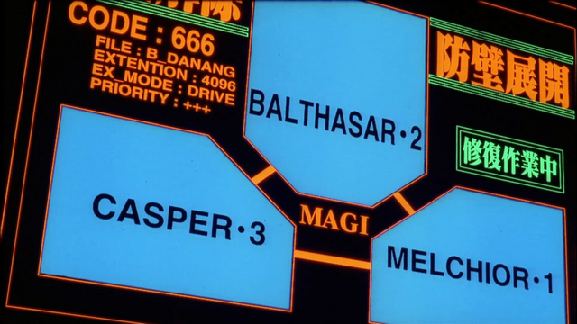

# Conclave

Conclave is a multi-agent consensus development system for coding agents. It orchestrates a council of AI reviewers (Claude, Gemini, and Codex) that independently analyze your work, synthesize their perspectives, and produce prioritized recommendations - all built on top of composable "skills" that activate automatically at the right moments.

> Forked from [obra/superpowers](https://github.com/obra/superpowers) under MIT license



## How It Works

It starts from the moment you fire up your coding agent. Before any code gets written, the system activates a brainstorming skill that teases out what you're actually trying to build through structured questions. You can answer interactively, or switch to **Consensus Autopilot** mode where the council of AI agents debates each design decision while you watch and intervene only when needed.

Once the design is validated (by multi-agent consensus), the system generates an implementation plan broken into bite-sized tasks. Each task gets dispatched to a fresh subagent with two-stage review: spec compliance first, then code quality. At every checkpoint, the council weighs in - architecture validation on plans, per-task review during execution, root cause validation during debugging, and a final multi-agent check before you merge.

The result: your coding agent works autonomously for hours at a time, with multiple AI perspectives catching issues that any single reviewer would miss. And because the skills trigger automatically, you don't need to do anything special.

## Multi-Agent Consensus

Consensus review triggers automatically at key workflow points:

```
Brainstorming -> Writing Plans -> Execution -> Debugging -> Verification
     |              |              |           |            |
  Design        Architecture    Per-task    Root cause   Final check
  validation    validation      review      validation   before done
```

**7 skills enhanced with consensus:**
- `brainstorming` - Design validation + autopilot mode
- `writing-plans` - Architecture/risk/scope validation
- `subagent-driven-development` - Third review stage after code quality
- `executing-plans` - Consensus review after each batch
- `finishing-a-development-branch` - Final review before merge
- `systematic-debugging` - Root cause hypothesis validation
- `verification-before-completion` - Multi-agent final check

### Consensus Autopilot

In brainstorming, you can choose **Consensus Autopilot** mode:

```
Two modes available:
1. Interactive - I ask questions, you answer
2. Consensus Autopilot - Multi-agent consensus answers questions,
   you watch and can interrupt anytime to override
```

The council debates each design decision while you watch. Interrupt anytime to override, go back, or take over.

### Using Consensus Directly

```bash
# Review code changes
./skills/multi-agent-consensus/auto-review.sh "Added authentication"

# Review with explicit base
./skills/multi-agent-consensus/auto-review.sh --base=HEAD~5 "Recent fixes"

# General question
./skills/multi-agent-consensus/consensus-synthesis.sh \
  --mode=general-prompt \
  --prompt="What could go wrong with this architecture?" \
  --context="$(cat design.md)"
```

---

## Installation

**Note:** Installation differs by platform. Claude Code has a built-in plugin system. Codex and OpenCode require manual setup.

### Claude Code (via Plugin Marketplace)

In Claude Code, register the marketplace first:

```bash
/plugin marketplace add signalnine/honest-gabes-marketplace
```

Then install the plugin from this marketplace:

```bash
/plugin install conclave@honest-gabes-marketplace
```

### Verify Installation

Check that commands appear:

```bash
/help
```

```
# Should see:
# /conclave:brainstorm - Interactive design refinement
# /conclave:write-plan - Create implementation plan
# /conclave:execute-plan - Execute plan in batches
```

### Codex

Tell Codex:

```
Fetch and follow instructions from https://raw.githubusercontent.com/signalnine/conclave/refs/heads/main/.codex/INSTALL.md
```

**Detailed docs:** [docs/README.codex.md](docs/README.codex.md)

### OpenCode

Tell OpenCode:

```
Fetch and follow instructions from https://raw.githubusercontent.com/signalnine/conclave/refs/heads/main/.opencode/INSTALL.md
```

**Detailed docs:** [docs/README.opencode.md](docs/README.opencode.md)

## The Basic Workflow

1. **brainstorming** - Activates before writing code. Refines rough ideas through questions, explores alternatives, presents design in sections for validation. Saves design document.

2. **using-git-worktrees** - Activates after design approval. Creates isolated workspace on new branch, runs project setup, verifies clean test baseline.

3. **writing-plans** - Activates with approved design. Breaks work into bite-sized tasks (2-5 minutes each). Every task has exact file paths, complete code, verification steps.

4. **subagent-driven-development** or **executing-plans** - Activates with plan. Dispatches fresh subagent per task with two-stage review (spec compliance, then code quality), or executes in batches with human checkpoints.

5. **test-driven-development** - Activates during implementation. Enforces RED-GREEN-REFACTOR: write failing test, watch it fail, write minimal code, watch it pass, commit. Deletes code written before tests.

6. **requesting-code-review** - Activates between tasks. Multi-reviewer consensus from Claude, Gemini, and Codex. Groups issues by agreement level (all agree -> high priority, majority -> medium, single -> consider). Critical issues block progress.

7. **finishing-a-development-branch** - Activates when tasks complete. Verifies tests, presents options (merge/PR/keep/discard), cleans up worktree.

**The agent checks for relevant skills before any task.** Mandatory workflows, not suggestions.

## What's Inside

### Skills Library

**Testing**
- **test-driven-development** - RED-GREEN-REFACTOR cycle (includes testing anti-patterns reference)

**Debugging**
- **systematic-debugging** - 4-phase root cause process (includes root-cause-tracing, defense-in-depth, condition-based-waiting techniques)
- **verification-before-completion** - Ensure it's actually fixed

**Collaboration**
- **brainstorming** - Socratic design refinement with optional multi-agent validation
- **multi-agent-consensus** - Get consensus from Claude/Gemini/Codex on any prompt (design validation, architecture decisions, debugging, code review)
- **writing-plans** - Detailed implementation plans
- **executing-plans** - Batch execution with checkpoints
- **dispatching-parallel-agents** - Concurrent subagent workflows
- **requesting-code-review** - Multi-reviewer code review using consensus framework
- **receiving-code-review** - Responding to feedback
- **using-git-worktrees** - Parallel development branches
- **finishing-a-development-branch** - Merge/PR decision workflow
- **subagent-driven-development** - Fast iteration with two-stage review (spec compliance, then code quality)
- **ralph-loop** - Autonomous iteration wrapper - runs tasks until success or iteration cap hit (fresh context per iteration, stuck detection, failure branches)

**Meta**
- **writing-skills** - Create new skills following best practices (includes testing methodology)
- **using-conclave** - Introduction to the skills system

## Message Bus

Conclave includes a message bus for inter-agent coordination, supporting two use cases:

### Consensus Debate (Stage 1.5)

Opt-in debate round between agents during consensus review. After independent analysis (Stage 1), agents see each other's thesis summaries and produce rebuttals before the chairman synthesizes (Stage 2).

```bash
# Enable debate round
conclave consensus --mode=general-prompt --debate \
  --prompt="Review this architecture" --context="$(cat design.md)"

# Control rounds and timeout
conclave consensus --debate --debate-rounds 2 --debate-timeout 90 ...
conclave auto-review --debate "Review recent changes"
```

### Parallel Bulletin Board

Wave-scoped boards let parallel ralph-run tasks share discoveries. Tasks emit structured markers in their output:

```
<!-- BUS:discovery -->The API uses cursor-based pagination<!-- /BUS -->
<!-- BUS:warning -->Package X v2 has breaking changes<!-- /BUS -->
<!-- BUS:intent -->Modifying internal/auth/handler.go<!-- /BUS -->
```

The orchestrator summarizes each wave's board for the next wave, giving later tasks accumulated project knowledge.

| Flag | Command | Description |
|------|---------|-------------|
| `--debate` | consensus, auto-review | Enable Stage 1.5 debate |
| `--debate-rounds` | consensus, auto-review | Number of rounds (max 2) |
| `--debate-timeout` | consensus, auto-review | Timeout per round (default 60s) |
| `--board-dir` | ralph-run | Bulletin board directory |
| `--board-topic` | ralph-run | Topic for board messages |
| `--task-id` | ralph-run | Task identifier for messages |

## Context Management

Long-running workflows (multi-wave execution, brainstorming sessions, debugging marathons) can exhaust the context window. Conclave skills include `/compact` guidance at phase transition points to proactively reclaim context before it becomes a problem.

**Skills with built-in compact checkpoints:**

| Skill | Compact Points |
|-------|---------------|
| `subagent-driven-development` | Between waves, before consensus review, before branch finish |
| `executing-plans` | Between batches, before branch completion |
| `brainstorming` | Before design presentation, before validation, before implementation handoff |
| `writing-plans` | Before consensus validation |
| `finishing-a-development-branch` | Before presenting merge options |
| `systematic-debugging` | Before implementing fix after investigation |

Each compact point includes a template with the right focus summary so compaction preserves what matters for the next phase. For example, between waves in subagent-driven-development:

```
/compact Completed waves 0-2. Tasks done: 1-5. Tasks remaining: 6-8. Next wave: tasks 6, 7.
```

The focus summary tells `/compact` what to prioritize when summarizing the conversation, ensuring later phases have clean context with the right details preserved.

## Prose Linter

Validate SKILL.md files and plan filenames against authoring standards:

```bash
# Lint everything (skills/ + docs/plans/)
conclave lint

# Lint specific directory or file
conclave lint skills/brainstorming/
conclave lint skills/brainstorming/SKILL.md

# JSON output for CI
conclave lint --json

# Custom word count threshold
conclave lint --word-limit 1000
```

**Rules checked:**

| Rule | Severity | What it checks |
|------|----------|----------------|
| `frontmatter-required` | error | YAML frontmatter with `name` and `description` |
| `frontmatter-schema` | error | No unexpected frontmatter fields |
| `description-prefix` | error | Description starts with "Use when" |
| `description-length` | error | Description under 1024 characters |
| `skill-naming` | error | Lowercase alphanumeric with hyphens |
| `cross-ref-valid` | error | `conclave:` cross-references resolve |
| `duplicate-name` | error | No two skills share a name |
| `plan-filename` | error | `YYYY-MM-DD-<topic>-{design,implementation}.md` |
| `description-verbose` | warning | Description over 200 characters |
| `word-count` | warning | Body exceeds word limit (default 3500) |

Exit code 0 = clean (or warnings only), exit code 1 = errors found.

## Token-Counting Proxy

Conclave includes a transparent reverse proxy that sits between Claude Code and the Anthropic API, counting input/output tokens per session for cost estimation and complexity budgeting.

```bash
# Terminal 1: start the proxy
conclave proxy --port 8199

# Terminal 2: point Claude Code at the proxy
ANTHROPIC_BASE_URL=http://localhost:8199 claude
```

Every API request is logged to stderr with model and token counts. When you Ctrl+C the proxy, it prints a session summary:

```
Session summary:
  Requests:             47
  Input tokens:         128,432
  Output tokens:        31,208
  Cache creation:       5,000
  Cache read:           10,000
  Total tokens:         159,640
```

Handles both streaming (SSE) and non-streaming responses. The proxy is fully transparent — all headers, bodies, and status codes pass through unmodified.

| Flag | Default | Description |
|------|---------|-------------|
| `--port` | 8199 | Port to listen on |
| `--target` | `https://api.anthropic.com` | Target API URL |

## Non-Interactive Mode

Set `CONCLAVE_NON_INTERACTIVE=1` to skip all interactive decision points. Skills automatically choose sensible defaults and announce each choice:

```bash
CONCLAVE_NON_INTERACTIVE=1 claude
```

| Skill | Decision Point | Default |
|-------|---------------|---------|
| `brainstorming` | Interactive vs Autopilot | Autopilot |
| `writing-plans` | Subagent-driven vs Parallel session | Subagent-driven |
| `executing-plans` | Wait for batch feedback | Continue (still fixes High Priority issues) |
| `finishing-a-development-branch` | Merge/PR/Keep/Discard | Merge locally |

## Philosophy

- **Test-Driven Development** - Write tests first, always
- **Systematic over ad-hoc** - Process over guessing
- **Complexity reduction** - Simplicity as primary goal
- **Evidence over claims** - Verify before declaring success

## Contributing

Skills live directly in this repository. To contribute:

1. Fork the repository
2. Create a branch for your skill
3. Follow the `writing-skills` skill for creating and testing new skills
4. Submit a PR

See `skills/writing-skills/SKILL.md` for the complete guide.

## Updating

Skills update automatically when you update the plugin:

```bash
/plugin update conclave
```

## License

MIT License - see LICENSE file for details

## Support

- **Issues**: https://github.com/signalnine/conclave/issues
