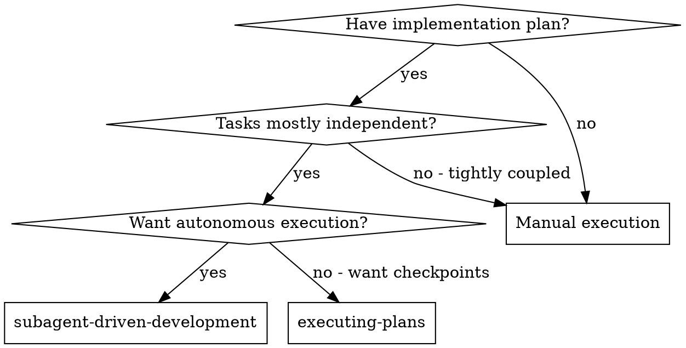
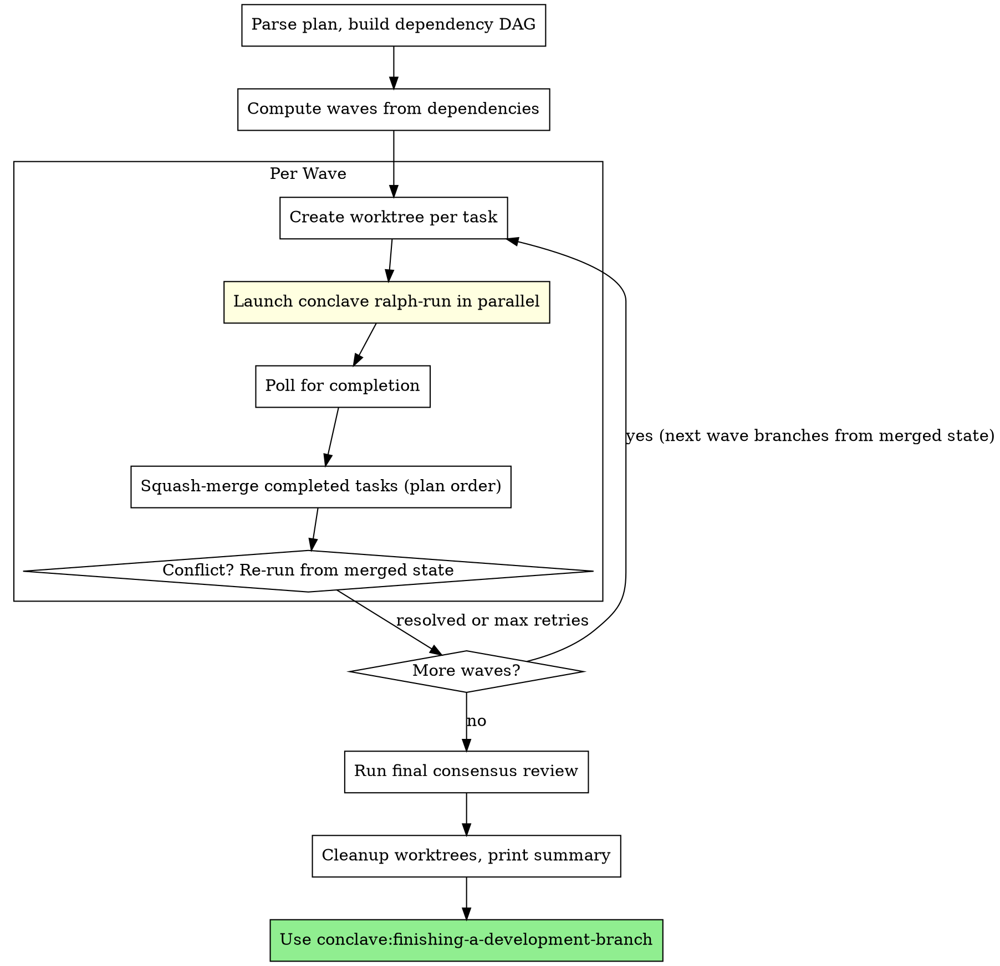

# Subagent-Driven Development

Execute plan by running tasks in parallel waves via git worktrees, each through **ralph-loop** for autonomous iteration with fresh context, then consensus review.

**Core principle:** Parallel waves (worktree isolation) + fresh context per iteration (ralph-loop) + consensus review = autonomous, high-quality task completion

## Ralph Loop Integration

Each task runs through `conclave ralph-run`:
- **Fresh context:** Each iteration is a clean `claude -p` invocation (no polluted context)
- **Iteration cap:** Max 5 attempts per task (configurable)
- **Stuck detection:** Same error 3x = try different approach or abort
- **Failure branches:** If cap hit, branch failed work and continue to next task
- **Gates:** Tests → Spec compliance → Code quality (all automated)

After ralph-loop succeeds, consensus review validates the work.

## When to Use



**Key difference from executing-plans:**
- Fully autonomous (ralph-loop handles retries)
- Fresh context per iteration (no conversation pollution)
- Failed tasks get branched and skipped (plan continues)

## The Process



## Context Management

**Compact between waves** to prevent context exhaustion during long executions:

- **After each wave completes** (merges done, before next wave): Run `/compact` with focus on the current state:
  ```
  /compact Completed waves 0-N. Tasks done: [list]. Tasks remaining: [list]. Current branch state: [summary]. Next wave: [tasks].
  ```
- **Before final consensus review**: Run `/compact` with focus on what was built:
  ```
  /compact All waves complete. Implemented: [summary of all tasks]. Ready for consensus review.
  ```
- **Before finishing-a-development-branch**: Run `/compact` with focus on merge readiness:
  ```
  /compact Implementation complete. [N] tasks done, [M] failed. Ready for branch completion.
  ```

**Why:** Each wave generates substantial output from task agents, merge operations, and conflict resolution. Without compaction, later waves run in degraded context.

## Task Execution

### Parallel Execution (default)

Run all tasks through `conclave parallel-run`:

```bash
./skills/subagent-driven-development/conclave parallel-run \
    docs/plans/YYYY-MM-DD-feature.md \
    --max-concurrent 3 \
    --non-interactive
```

The orchestrator handles everything automatically:
1. **Parse plan** - Extracts tasks, dependencies, files
2. **Compute waves** - Groups tasks by dependency depth
3. **Execute waves** - Per wave:
   - Creates git worktree per task (from merged state of prior waves)
   - Launches `conclave ralph-run --worktree` in each worktree in parallel
   - Polls for completion
   - Squash-merges completed tasks in plan order
   - Re-runs tasks on merge conflicts (up to `PARALLEL_MAX_CONFLICT_RERUNS`)
4. **Consensus review** - Runs `conclave auto-review` on all merged changes
5. **Cleanup** - Removes worktrees, prints summary

### Dry Run (preview schedule)

```bash
./skills/subagent-driven-development/conclave parallel-run \
    docs/plans/YYYY-MM-DD-feature.md \
    --dry-run
```

### Sequential Fallback

For tightly-coupled tasks or debugging, run tasks one at a time:

```bash
TASK_SPEC=$(mktemp --suffix=.md)
# Write task spec...
./skills/ralph-loop/conclave ralph-run "task-name" "$TASK_SPEC" --non-interactive -d "$(pwd)"
```

## Example Workflow

```
========================================
Parallel Runner
Plan: docs/plans/feature-plan.md
Max concurrent: 3
Base branch: feature/my-feature
========================================

--- Phase 1: Parsing Plan ---
Tasks found: 5
Waves: 3
  Wave 0: tasks 1 2 3
  Wave 1: tasks 4
  Wave 2: tasks 5

--- Phase 2: Setup ---

--- Phase 3: Executing Waves ---

━━━━━━━━━━━━━━━━━━━━━━━━━━━━━━━━━━━━━━━━
Wave 0
━━━━━━━━━━━━━━━━━━━━━━━━━━━━━━━━━━━━━━━━
[WAVE 0] Launching Task 1: Create utilities
[WAVE 0] Launching Task 2: Build core module
[WAVE 0] Launching Task 3: Add config parser
[WAVE 0] Task 1 COMPLETED
[WAVE 0] Task 2 COMPLETED
[WAVE 0] Task 3 FAILED (exit 1)

[WAVE 0] Merging completed tasks...
[MERGE] Squash-merging task/1-create-utilities...
[MERGE] Successfully merged task/1-create-utilities
[MERGE] Squash-merging task/2-build-core-module...
[MERGE] Successfully merged task/2-build-core-module

━━━━━━━━━━━━━━━━━━━━━━━━━━━━━━━━━━━━━━━━
Wave 1
━━━━━━━━━━━━━━━━━━━━━━━━━━━━━━━━━━━━━━━━
[WAVE 1] Launching Task 4: Integration layer
[WAVE 1] Task 4 COMPLETED

[WAVE 1] Merging completed tasks...
[MERGE] Successfully merged task/4-integration-layer

━━━━━━━━━━━━━━━━━━━━━━━━━━━━━━━━━━━━━━━━
Wave 2
━━━━━━━━━━━━━━━━━━━━━━━━━━━━━━━━━━━━━━━━
[WAVE 2] Launching Task 5: CLI entry point
[WAVE 2] Task 5 COMPLETED

--- Phase 4: Consensus Review ---
Running consensus review on all merged changes...

--- Cleanup ---

========================================
PARALLEL EXECUTION SUMMARY
========================================
  Completed: 4/5
  Failed:    1
  Skipped:   0
========================================
  Task 3 (Add config parser): FAILED - check wip/ralph-fail-* branches
```

## Advantages

**Fresh context per iteration:**
- No polluted context from failed attempts
- Each retry starts clean
- Can break out of stuck patterns

**Autonomous execution:**
- No human-in-loop during task execution
- Ralph-loop handles all retries
- Failed tasks get branched and skipped

**Forward progress guaranteed:**
- Iteration cap prevents infinite loops
- Failed tasks don't block plan
- Failure branches preserve work for later

**Quality gates:**
- Tests must pass (hard gate)
- Spec compliance verified (hard gate)
- Code quality checked (soft gate)
- Consensus review after success

## Configuration

Environment variables for parallel execution:

| Variable | Default | Description |
|----------|---------|-------------|
| `PARALLEL_MAX_CONCURRENT` | 3 | Max simultaneous tasks per wave |
| `PARALLEL_WORKTREE_DIR` | .worktrees | Worktree directory |
| `PARALLEL_MAX_CONFLICT_RERUNS` | 2 | Max re-runs for merge conflicts |

Environment variables for ralph-loop (per-task):

| Variable | Default | Description |
|----------|---------|-------------|
| `RALPH_TIMEOUT_IMPLEMENT` | 1200s | Implementation timeout |
| `RALPH_TIMEOUT_TEST` | 600s | Test timeout |
| `RALPH_TIMEOUT_GLOBAL` | 3600s | Overall loop timeout |
| `RALPH_STUCK_THRESHOLD` | 3 | Same error count before stuck |

## Red Flags

**Never:**
- Start implementation on main/master branch without explicit user consent
- Skip consensus review after ralph-loop succeeds
- Proceed with High Priority consensus issues
- Run conclave parallel-run without worktree isolation
- Merge task branches out of plan order
- Create dependent task worktrees from base branch (must use merged state)
- Manually intervene during ralph-loop execution
- Skip failed tasks without creating failure branch

**If ralph-loop fails:**
- Failure branch already created
- Task marked FAILED, dependents marked SKIPPED
- Continue to next task in wave
- Don't try to fix manually

**If consensus finds High Priority issues:**
- Mark task as needing rework
- Could re-run ralph-loop with additional context
- Or mark FAILED and continue

## Integration

**Required:**
- **conclave:using-git-worktrees** - REQUIRED: Set up isolated workspace before starting
- **conclave:ralph-loop** - Autonomous iteration engine
- **conclave:multi-agent-consensus** - Consensus review
- **conclave:finishing-a-development-branch** - Complete development

**Plan source:**
- **conclave:writing-plans** - Creates the plan this skill executes

## Files

- `./conclave parallel-run` - Main orchestrator for parallel execution
- `./lib/parse-plan.sh` - Plan parser (tasks, dependencies, waves)
- `./lib/scheduler.sh` - Wave-based task scheduler
- `./lib/merge.sh` - Squash-merge with conflict detection
- `./lib/helpers.sh` - Worktree setup and utility functions
- `./implementer-prompt.md` - Reference for task spec format (used by ralph-loop internally)
- `./spec-reviewer-prompt.md` - Reference for spec review (used by ralph-loop internally)
- `./code-quality-reviewer-prompt.md` - Reference for quality review
